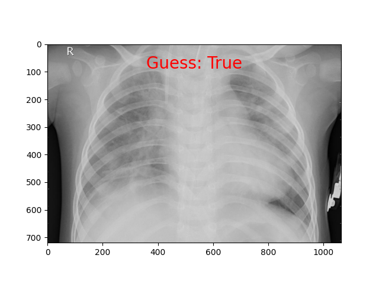
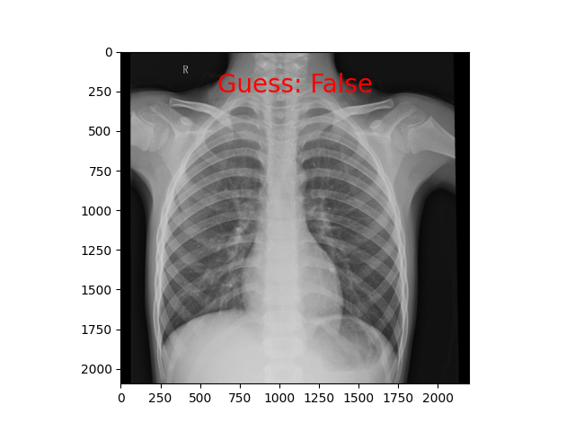

#Pneumonia Classification Using a Custom Model

This project uses a classification custom model to infer whether or not a patient has Pneumonia based on their x-ray scans.

##Table of Contents

- [Installation](#Installation)
- [Usage](#Usage)
- [Examples](#Examples)
- [Example Images](#Example-Images)
- [Model Structure](#Model-Structure)
- [Requirements](#Requirements)
- [Contributing](#Contributing)
- [License](#License)

## Installation
To get started clone the repository and install the required dependencies

## Usage
You can use the model to predict whether a patients x-ray is likely to have Pneumonia using the 'PneumoniaPredictor.predict()' method in the inference.py file.

First, instanciate the predictor class: predictor = PneumoniaPredictor()

Second, get a prediction using predict on the instanciated class: predictor.predict(image)

  The image can be in the form of a PIL.Image, torch.Tensor, or Path

There are other parameters you can play with.

## Examples

example1.py: Example of using a path to an image

example2.py: Example of using a Image object

example3.py: Example of using a torch.Tensor Object

example4.py: Example of getting the class scores

## Example Images

### Example 1: The image of someone with pneumonia

### Example 2: The image of someone without pneumonia

## Model Structure:

### The model follows a fairly simple structure:

1st Convolutional Layer: 

- Conv2d
- ReLU
- Conv2d
- Maxpool2d

2nd Convolutional Layer:

- Conv2d
- ReLU
- Conv2d
- Maxpool2d

Flatten Layer:

- Flatten

Linear Layer:

- Linear

## Requirements

torch==1.13.1: PyTorch, for Torch tools

torchvision==0.14.1: TorchVision, for computer vision tools

matplotlib==3.7.0: Matplotlib, for visualization

Pillow==9.4.0: Pillow, for image manipulation

numpy==1.21.6: NumPy, for manipulating tensors to better be used by other libraries

## Contributing

The images used to train the model and the images included in this repository are from Tolga on Kaggle: https://www.kaggle.com/datasets/tolgadincer/labeled-chest-xray-images?resource=download

## License

This Repo is under a CCO 1 Universal License

Just don't steal outright plz :)